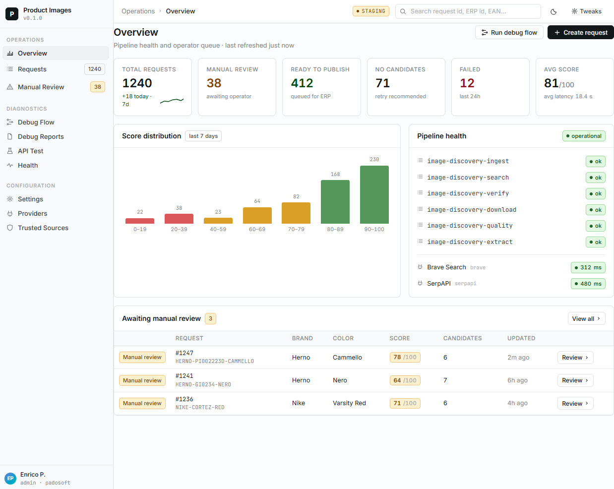
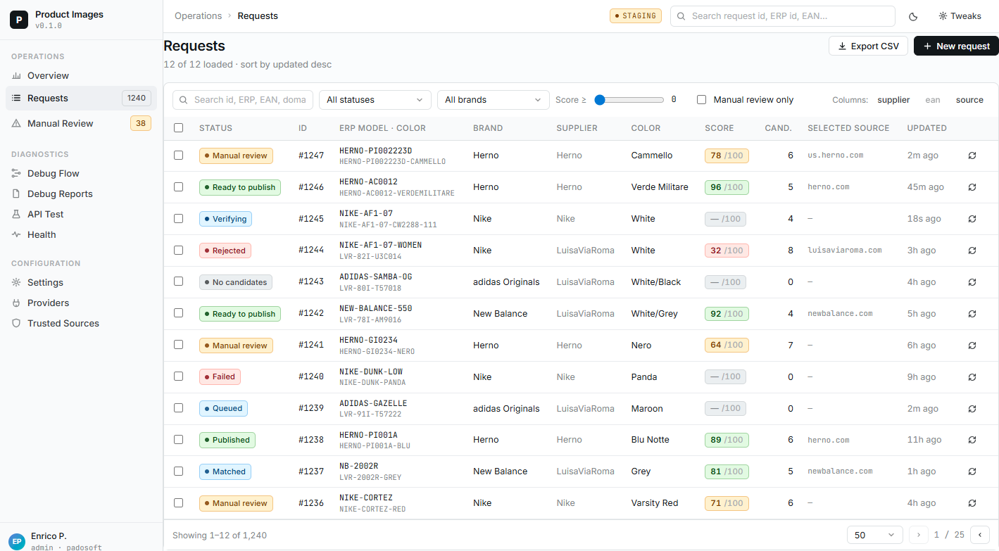
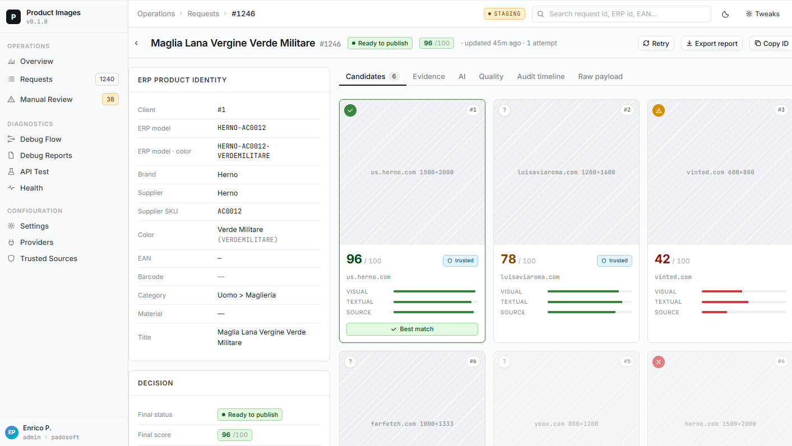
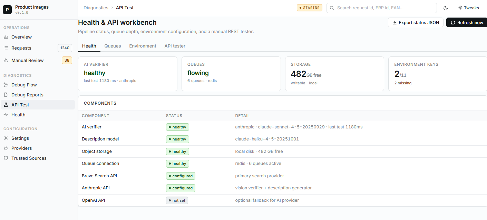
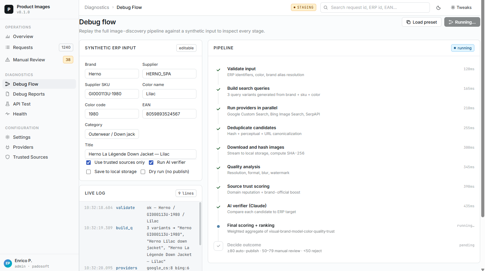
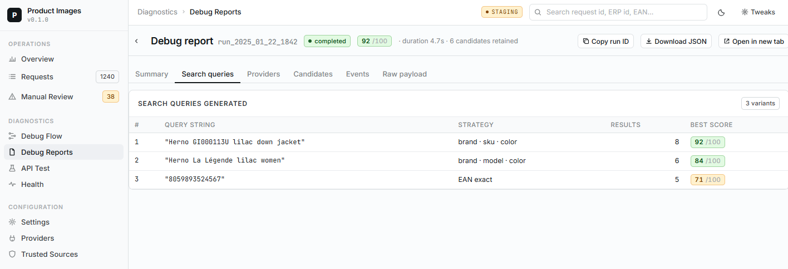
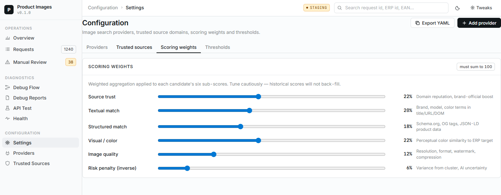
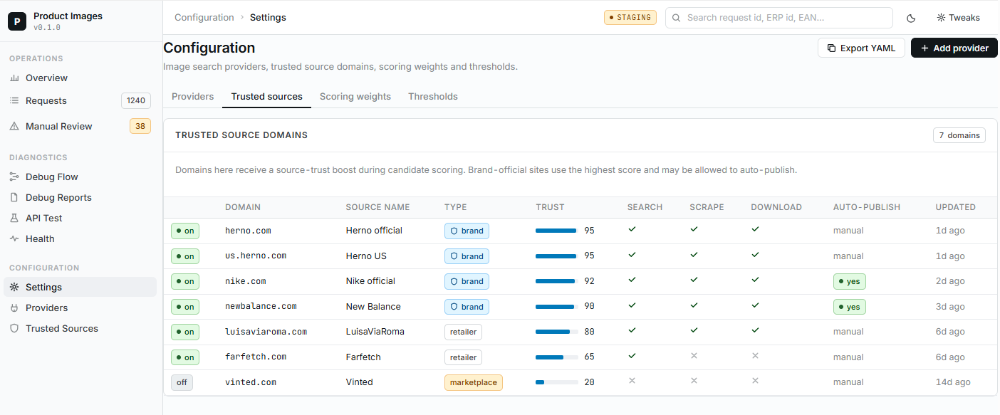

# Product Image Discovery Admin

[](https://github.com/padosoft/product_image_discovery_admin/actions/workflows/ci.yml)
[](https://github.com/padosoft/product_image_discovery_admin/releases)
[](https://www.php.net/)
[](https://laravel.com/)
[](https://react.dev/)
[](https://vite.dev/)
[](LICENSE)

Professional Laravel admin console for [`padosoft/product-image-discovery`](https://github.com/padosoft/product_image_discovery): inspect discovery requests, approve or reject candidates, tune provider configuration, run diagnostics, and ship safer product-image workflows without building a back office from scratch.



## Table of Contents

- [Why Teams Use It](#why-teams-use-it)
- [What You Get](#what-you-get)
- [Screenshots](#screenshots)
- [Architecture](#architecture)
- [Quickstart](#quickstart)
- [Local Setup](#local-setup)
- [Login](#login)
- [Demo Data](#demo-data)
- [Testing](#testing)
- [CI](#ci)
- [Security Model](#security-model)
- [Admin Routes](#admin-routes)
- [Relationship To The Package](#relationship-to-the-package)
- [Process Docs](#process-docs)
- [License](#license)

## Why Teams Use It

Product images are operational data. A wrong product-color image can leak into ERP, PIM, marketplaces, catalogs, feeds, and customer-facing storefronts. This admin app gives catalog and operations teams a dense, production-shaped cockpit for the conservative discovery pipeline in `padosoft/product-image-discovery`.

- Review uncertain matches before they publish.
- Compare candidates with source, score, AI, quality, and audit evidence.
- Manage thresholds, providers, trusted sources, and client overrides.
- Run debug flows against real or fake providers.
- Inspect health, queues, storage, AI configuration, and redacted reports.
- Export filtered request data and keep demo operator filters locally.

## What You Get

- **Operations dashboard** with KPI cards, score distribution, provider readiness, queue phase health, latest attention items, and shortcuts.
- **Requests and Manual Review** pages with dense filters, pagination, CSV export, detail drawer, compare mode, protected image previews, approve/reject/retry flows, and audit timeline.
- **Configuration tools** for settings, search providers, provider credential status, trusted sources, trust scores, policies, scopes, and URL patterns.
- **Diagnostics suite** with guided debug-flow runner, report viewer, JSON search, redacted report download, health checks, and API workbench.
- **Offline demo path** with deterministic seeded data for Herno, Nike, and New Balance scenarios.
- **Release gate** through PHPUnit, Vitest, Vite, Playwright, Composer validation, and GitHub Actions.

## Screenshots

### Overview Dashboard


### Request Search



### Request Detail And Candidate Review



### API Test Workbench



### Debug Flow



### Debug Flow Results



### Scoring Configuration



### Trusted Sources Configuration



## Architecture

This repository is a Laravel 13 admin/demo application, not a reusable UI package. It consumes the sibling headless package through a Composer path repository:

```text
..\product_image_discovery
..\product_image_discovery_admin
```

The stack is intentionally boring and inspectable:

- Laravel 13 host app.
- SQLite by default for local development and tests.
- Blade shell at the admin route.
- Vite + React for the operator UI.
- Session/CSRF-protected admin JSON wrappers.
- Package API left available under its own prefix.
- Playwright browser smoke coverage for desktop and tablet layouts.

## Quickstart

End-to-end walkthrough from a fresh clone to a working Brave-backed debug run on macOS/Linux. Windows/Herd users have an equivalent block below in [Local Setup](#local-setup).

Prerequisites: PHP 8.3+, Composer, Node 20+ (npm 10+), and a checkout of the sibling package next to this repo:

```text
parent/
├─ product_image_discovery/         # headless package
└─ product_image_discovery_admin/   # this repo
```

### 1. Install dependencies

```bash
composer install
npm ci
```

### 2. Configure the environment

```bash
cp .env.example .env
php artisan key:generate
touch database/database.sqlite
```

Open `.env` and confirm at minimum:

```dotenv
APP_URL=http://127.0.0.1:8000
DB_CONNECTION=sqlite
DB_DATABASE=/absolute/path/to/database/database.sqlite   # or leave default
SESSION_DRIVER=file
PID_ADMIN_ROUTE_MIDDLEWARE=web
PID_ADMIN_DEBUG_RUN_MIDDLEWARE=auth
```

`BRAVE_SEARCH_API_KEY` is intentionally **not** read from `.env`. Search-provider credentials live in the database (write-only via the admin UI). See step 6.

### 3. Migrate and seed demo data

```bash
php artisan migrate
php artisan pid-admin:seed-demo
```

This creates:

- the deterministic Herno / Nike / New Balance demo requests,
- a demo `fake-demo` search provider (seeded `is_active=true`, `priority=1`),
- a demo admin user — **email `admin@demo.test`, password `password`**, **only when `APP_ENV` is `local` or `testing`**. In any other environment the seeder skips the user step so a known-credentials operator never lands in a non-dev DB. Use `pid-admin:create-user` for staging/production.

> The artisan command is namespaced. Use `pid-admin:seed-demo`, not `seed-demo`.

If you want a real user instead of the demo one:

```bash
php artisan pid-admin:create-user you@example.com --name="You" --password=secret
# omit --password to receive a generated one (printed once)
```

### 4. Build the frontend and start the server

```bash
npm run build
php artisan serve
```

Leave `php artisan serve` running. For frontend hot reload during development run `npm run dev` in a second terminal instead of `npm run build`.

### 5. Sign in

Open `http://127.0.0.1:8000/login`, log in with `admin@demo.test` / `password`, and you'll land on `http://127.0.0.1:8000/admin/product-image-discovery`.

The admin shell (Blade + React) uses the configured `web` middleware, but `/debug-runs` and `POST /requests` sit behind `auth` by default, which is why the login step is required before they respond. The Logout button lives in the topbar.

### 6. Configure a real search provider (Brave)

The demo `fake-demo` provider is intentionally first in priority so out-of-the-box runs work offline. To exercise a real Brave search you need to either disable the fake provider or give Brave a higher priority (lower number).

1. Sign in, then open `http://127.0.0.1:8000/admin/product-image-discovery/providers`.
2. Edit `fake-demo` and set `is_active = false`, **or** keep it active and bump its `priority` to a high number (e.g. `100`).
3. Create or update a Brave provider:
   - `code`: `brave`
   - `driver`: `brave`
   - `name`: `Brave`
   - `base_url`: `https://api.search.brave.com`
   - `api_key`: your Brave API key (write-only — saved encrypted, never echoed back)
   - `is_active`: `true`
   - `priority`: `1` (or any value lower than the rest)

> Provider selection: `SearchProviderManager` orders active providers by `priority` ASC and uses the first that returns non-empty results. The rest are treated as fallbacks.

### 7. Run a debug flow against Brave

1. Open `http://127.0.0.1:8000/admin/product-image-discovery/debug`.
2. Leave the default Herno payload (or paste your own product JSON).
3. Recommended options for a first real test:
   - `no_env_brave: true` (default) — keep it; we are using the DB provider, not auto-creating one from env.
   - `no_download: true` (default) — skip downloading the candidate images. You will still see them via the **View Image** column in the report.
   - `max_candidates: 2` (default) or higher.
4. Click **Run debug**. The right panel polls until status becomes `succeeded` or `failed`.

### 8. Inspect the report

Open `http://127.0.0.1:8000/admin/product-image-discovery/reports`, click **Open** on the latest run.

In the **Candidates** tab the table is sorted by `final_score` desc — the top row is the best match. Each row exposes:

- `View URL` — opens `source_page_url` in a new tab (the page Brave found)
- `View Image` — opens `image_url` in a new tab (works even with `no_download: true`)

Empty/invalid URLs render as a disabled chip.

### Common pitfalls

- **`401 Unauthorized` on `/debug-runs`** — you are not signed in. Visit `/login` (step 5).
- **`Command "seed-demo" is not defined`** — use the prefix: `php artisan pid-admin:seed-demo`.
- **`BRAVE_SEARCH_API_KEY missing` on the Health screen** — the slot label is now `BRAVE_SEARCH_PROVIDER`. It checks the DB, not env. Configure a Brave provider (step 6).
- **Brave never gets called** — the `fake-demo` provider has `priority: 1` and short-circuits the chain. Disable it or raise its priority (step 6).
- **All candidates land in `manual_review` even with high score** — that's expected without trusted sources. Add the candidate's host on `/admin/product-image-discovery/trusted` if you want `verified_match`/`ready_to_publish`.
- **You changed React/CSS and don't see the change** — `npm run build` writes to `public/build/`; the browser may cache the old bundle. Hard refresh (`Cmd+Shift+R` on macOS, `Ctrl+F5` on Linux). For iterative work prefer `npm run dev`.

## Local Setup

Keep the headless package checked out beside this app:

```text
..\product_image_discovery
..\product_image_discovery_admin
```

Install and bootstrap the app:

```powershell
composer install
Copy-Item .env.example .env -ErrorAction SilentlyContinue
php artisan key:generate --ansi
New-Item -ItemType File database\database.sqlite -Force
php artisan migrate
php artisan pid-admin:seed-demo --fresh
npm ci
npm run build
php artisan serve
```

Open:

```text
http://127.0.0.1:8000/admin/product-image-discovery
```

If `php` is not on PATH, this Windows/Herd workstation uses:

```text
%USERPROFILE%\.config\herd\bin\php84\php.exe
```

## Login

Debug-run endpoints (`POST /admin/product-image-discovery/debug-runs`, `POST /admin/product-image-discovery/requests`) sit behind the `auth` middleware controlled by `pid-admin.debug_run_middleware`. The admin shell itself runs under `web` only, but operators must sign in before the debug and request-creation surfaces respond.

The app ships with three minimal endpoints, registered outside the admin prefix:

```text
GET  /login
POST /login
POST /logout
```

The `pid-admin:seed-demo` command seeds a demo operator suitable for local/offline testing **only when `APP_ENV` is `local` or `testing`**:

- email: `admin@demo.test`
- password: `password`

Outside those environments the seeder skips the demo user, so a well-known credential never lands in a staging or production database. Use `pid-admin:create-user` instead.

Create or update a real user with the artisan helper:

```bash
php artisan pid-admin:create-user me@example.com --name="Op"
# omit --password to receive a generated one (printed once)
php artisan pid-admin:create-user me@example.com --password=secret
```

The admin topbar exposes a Logout button that submits a CSRF-protected `POST /logout`.

To bypass auth in CI or short-lived local smoke tests, leave `PID_ADMIN_DEBUG_RUN_MIDDLEWARE` empty. The PHPUnit suite already does this in `phpunit.xml`.

## Demo Data

The local seeder gives you deterministic, offline-friendly scenarios:

- Herno manual-review fashion request.
- Nike candidate review and retry/no-candidate workflows.
- New Balance ready/selected-image example.
- Fake demo provider and trusted demo sources.
- Inline generated candidate images so previews work without live downloads.

Reset the demo state with:

```powershell
php artisan pid-admin:seed-demo --fresh
```

## Testing

Run the full local release gate:

```powershell
composer validate --strict
npm run phpunit
npm run test
npm run build
npm run e2e
```

`npm run phpunit` is the preferred PHP test entry point on this machine because it resolves Herd PHP 8.4 before falling back to `php` on PATH.

## CI

GitHub Actions runs the same release gate on pushes and pull requests:

- checkout this admin app and the sibling `padosoft/product_image_discovery` package
- `composer validate --strict`
- `composer install`
- `npm ci`
- `npm run phpunit`
- `npm run test`
- `npm run build`
- `npm run e2e:ci`
- upload Playwright traces/screenshots on failure

## Security Model

- Provider credentials are write-only.
- JSON responses expose credential booleans such as `has_api_key`, never raw secrets or partial previews.
- Debug reports and stored artifacts are redacted before display/download.
- Admin wrappers use same-origin fetch and CSRF/session protection.
- High-impact debug/request creation endpoints support stricter configurable middleware and throttling.
- Candidate source URLs are normalized before browser navigation.
- CSV exports neutralize spreadsheet formula prefixes in untrusted text cells.

## Admin Routes

The admin console lives at:

```text
/admin/product-image-discovery
```

Admin JSON wrappers live under:

```text
/admin/product-image-discovery/...
```

The package API remains available at:

```text
/api/product-image-discovery/...
```

## Relationship To The Package

Use this app when you want the ready-made professional admin experience. Use [`padosoft/product-image-discovery`](https://github.com/padosoft/product_image_discovery) directly when you only need the headless API, models, jobs, configuration, and package-level integration surface.

The admin app intentionally stays close to the package contracts and avoids exposing implementation-only secrets or internal raw payloads.

## Process Docs

Read `AGENTS.md` first when resuming this project. The durable implementation plan is saved at:

```text
%USERPROFILE%\Downloads\productimagesearch-admin\plan.md
```

The project history and non-obvious setup lessons are tracked in:

- [`docs/PROGRESS.md`](docs/PROGRESS.md)
- [`docs/LESSON.md`](docs/LESSON.md)
- [`docs/RULES.md`](docs/RULES.md)

## License

Apache-2.0. See [LICENSE](LICENSE).
